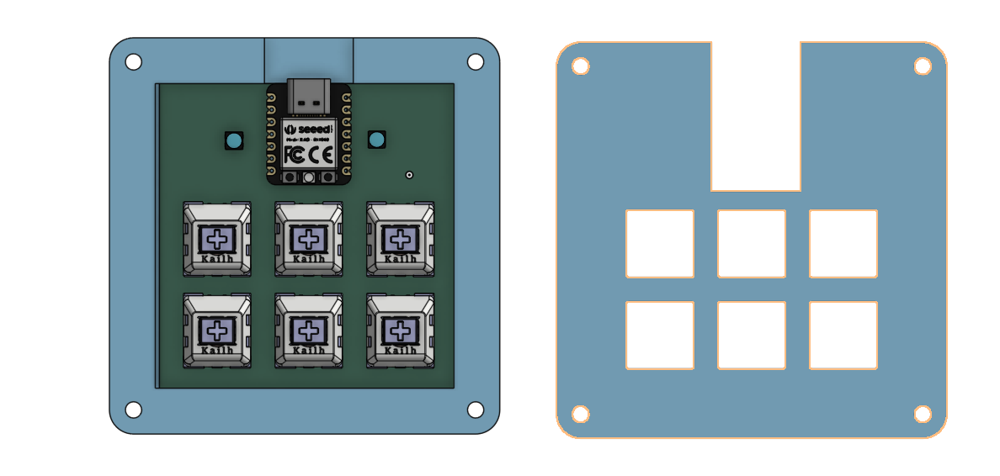
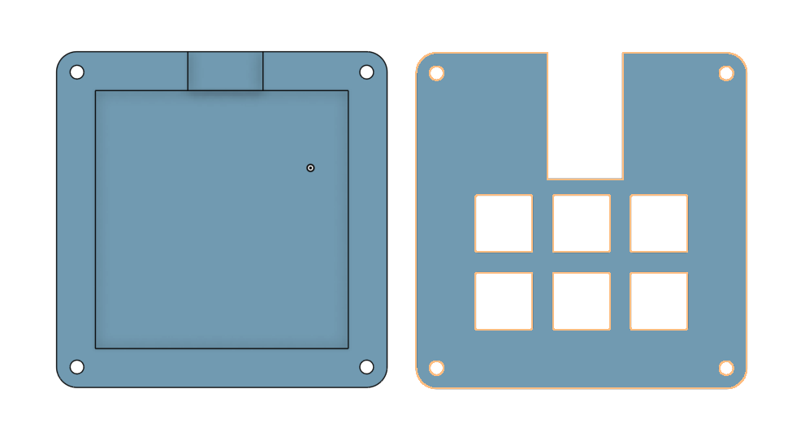
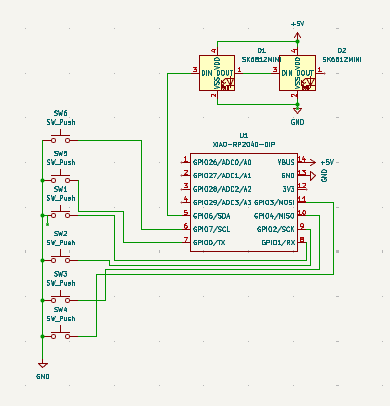
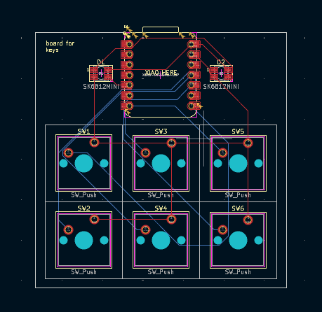

### Jesse's Blueprint Macropad

This is my version of Blueprint's tutorial on making a Hackpad.

### CAD Model

Full Design

Case Only

This design was made using OnShape.

### PCB

Schematic            |  PCB
:-------------------------:|:-------------------------:
    |  

The PCB was made using KiCAD.

### Firmware

All the firmware is made with KMK.

### BOM

The following should be a complete list of all required materials:
- 6x Cherry MX Switches
- 2x SK6812 MINI Leds
- 1x XIAO RP2040
- 6x Blank DSA Keycaps
- 4x M3x16 Bolt
- 4x M3 Heatset
